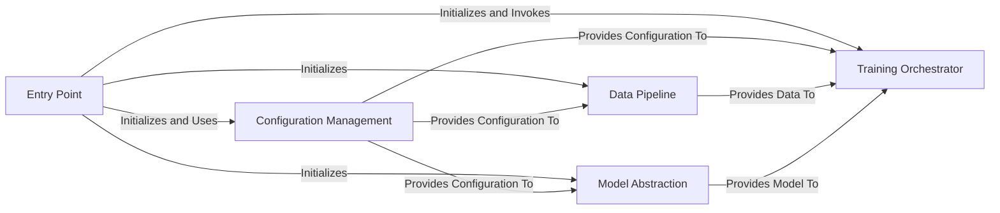

<p align="center">
        🤗 <a href="https://hf.co/Tonic">Hugging Face</a>&nbsp&nbsp | &nbsp&nbsp🤖 <a href="https://huggingface.co/spaces/Tonic/Petite-LLM-3">demo</a>&nbsp&nbsp | &nbsp&nbsp 📑 <a href="https://huggingface.co/blog/Tonic/SmolFactory">Blog</a> &nbsp&nbsp ｜ &nbsp&nbsp🖥️ <a href="https://huggingface.co/Tonic/petite-elle-L-aime-3-sft">Model</a>
<br>
<a href="https://huggingface.co/spaces/Tonic/Track-Tonic">Monitoring</a>&nbsp&nbsp | &nbsp&nbsp
<a href="https://discord.gg/qdfnvSPcqP">
  
</a>&nbsp&nbsp ｜  &nbsp&nbsp<a href="https://huggingface.co/datasets/Tonic/trackio-experiments">Dataset</a> 
</p>


# 🤏🏻🏭SmolFactory

SmolFactory helps you train , monitor and deploy your Smollm3 finetune , and more !

<table>
  <tr>
    <td>
      
    </td>
    <td>
      
    </td>
    <td>
      
    </td>
  </tr>
</table>


Train and deploy your model with one simple command !

## 🤖 Automatically Push Model, Spaces, Datasets & Monitoring

- **Automatic Deployment**: Spaces created and configured automatically during the pipeline
- **Trackio Monitoring Space**: Real-time training metrics, loss curves, and resource utilization
- **Demo Spaces**: Instant web interfaces for model testing and demonstration
- **Real-time Metrics**: Live training loss, learning rate, gradient norms, and GPU utilization
- **Custom Dashboards**: Tailored visualizations for SmolLM3 fine-tuning
- **Artifact Logging**: Model checkpoints, configuration files, and training logs
- **Experiment Comparison**: Side-by-side analysis of different training runs
- **Alert System**: Notifications for training issues or completion
- **Integration**: Seamless connection with HF Spaces for public monitoring
- **Experiment Tracking**: All training data, metrics, and artifacts stored in HF Datasets
- **Reproducibility**: Complete experiment history with configuration snapshots
- **Collaboration**: Easy sharing of training results and model comparisons
- **Version Control**: Track dataset changes and model performance over time

## 🚀 Quick Start

### Interactive Pipeline (Recommended)

The easiest way to get started is using the interactive pipeline:

```bash
./launch.sh
```

This script will:
1. **Authenticate** with Hugging Face (write + read tokens)
2. **Configure** training parameters interactively
3. **Deploy** Trackio Space for monitoring
4. **Setup** HF Dataset for experiment tracking
5. **Execute** training with your chosen configuration
6. **Push** model to HF Hub with comprehensive documentation
7. **Deploy** demo space for testing (optional)

### Manual Setup

For advanced users who want to customize the pipeline:

```bash
# 1. Install dependencies
pip install -r requirements/requirements_core.txt

# 2. Configure your training
python scripts/training/train.py \
    --config config/train_smollm3_h100_lightweight.py \
    --experiment-name "my-experiment" \
    --output-dir ./outputs \
    --trackio-url "https://huggingface.co/spaces/username/trackio-monitoring"

# 3. Push model to HF Hub
python scripts/model_tonic/push_to_huggingface.py \
    ./outputs username/model-name \
    --token YOUR_HF_TOKEN
```


## 🏗️ Repository Architecture




## 🔧 Core Components

### Configuration System (`config/`)

All training configurations inherit from `SmolLM3Config`:

```python
# config/my_config.py
from config.train_smollm3 import SmolLM3Config

config = SmolLM3Config(
    model_name="HuggingFaceTB/SmolLM3-3B",
    max_seq_length=8192,
    batch_size=8,
    learning_rate=5e-6,
    trainer_type="sft",  # or "dpo"
    enable_tracking=True,
    trackio_url="https://huggingface.co/spaces/username/trackio-monitoring"
)
```

### Dataset Processing (`src/data.py`)

The `SmolLM3Dataset` class handles multiple dataset formats:

```python
from src.data import SmolLM3Dataset

# Supports multiple formats:
# 1. Chat format (recommended)
# 2. Instruction format
# 3. User-Assistant format
# 4. Hugging Face datasets

dataset = SmolLM3Dataset(
    data_path="my_dataset",
    tokenizer=tokenizer,
    max_seq_length=4096,
    use_chat_template=True,
    sample_size=80000  # For lightweight training
)
```

### Training Orchestration (`src/train.py`)

The main training script coordinates all components:

```python
from src.train import main
from src.model import SmolLM3Model
from src.trainer import SmolLM3Trainer, SmolLM3DPOTrainer

# SFT Training
trainer = SmolLM3Trainer(
    model=model,
    dataset=dataset,
    config=config,
    output_dir="./outputs"
)

# DPO Training
dpo_trainer = SmolLM3DPOTrainer(
    model=model,
    dataset=dataset,
    config=config,
    output_dir="./dpo-outputs"
)
```

## 🎯 Training Types

### Supervised Fine-tuning (SFT)

Standard instruction tuning for improving model capabilities:

```bash
python scripts/training/train.py \
    --config config/train_smollm3.py \
    --trainer-type sft \
    --experiment-name "sft-experiment"
```

### Direct Preference Optimization (DPO)

Preference-based training for alignment:

```bash
python scripts/training/train.py \
    --config config/train_smollm3_dpo.py \
    --trainer-type dpo \
    --experiment-name "dpo-experiment"
```

## 📊 Monitoring & Tracking

### Trackio Integration

The pipeline includes comprehensive monitoring:

```python
from src.monitoring import create_monitor_from_config

monitor = create_monitor_from_config(config)
monitor.log_metrics({
    "train_loss": loss,
    "learning_rate": lr,
    "gradient_norm": grad_norm
})
```

### HF Dataset Integration

Experiment data is automatically saved to HF Datasets:

```python
# Automatically configured in launch.sh
dataset_repo = "username/trackio-experiments"
```

## 🔄 Model Management

### Pushing to HF Hub

```bash
python scripts/model_tonic/push_to_huggingface.py \
    ./outputs username/model-name \
    --token YOUR_HF_TOKEN \
    --trackio-url "https://huggingface.co/spaces/username/trackio-monitoring" \
    --experiment-name "my-experiment"
```

### Model Quantization

Create optimized versions for deployment:

```bash
# Quantize and push to HF Hub
python scripts/model_tonic/quantize_standalone.py \
    ./outputs username/model-name \
    --quant-type int8_weight_only \
    --token YOUR_HF_TOKEN

# Quantize for CPU deployment
python scripts/model_tonic/quantize_standalone.py \
    ./outputs username/model-name \
    --quant-type int4_weight_only \
    --device cpu \
    --save-only
```

## 🛠️ Customization Guide

### Adding New Training Configurations

1. Create a new config file in `config/`:

```python
# config/train_smollm3_custom.py
from config.train_smollm3 import SmolLM3Config

config = SmolLM3Config(
    model_name="HuggingFaceTB/SmolLM3-3B-Instruct",
    max_seq_length=16384,
    batch_size=4,
    learning_rate=1e-5,
    max_iters=2000,
    trainer_type="sft"
)
```

2. Add to the training script mapping in `scripts/training/train.py`:

```python
config_map = {
    # ... existing configs ...
    "config/train_smollm3_custom.py": get_custom_config,
}
```

### Custom Dataset Formats

Extend `src/data.py` to support new formats:

```python
def _load_custom_format(self, data_path: str) -> Dataset:
    """Load custom dataset format"""
    # Your custom loading logic here
    pass
```

### Custom Training Loops

Extend `src/trainer.py` for specialized training:

```python
class SmolLM3CustomTrainer(SmolLM3Trainer):
    def training_step(self, batch):
        # Custom training logic
        pass
```

## 🔧 Development & Contributing

### Project Structure

- **`src/`**: Core training modules
- **`config/`**: Training configurations
- **`scripts/`**: Utility scripts and automation
- **`docs/`**: Comprehensive documentation
- **`tests/`**: Test files and debugging tools

### Adding New Features

1. **Configuration**: Add to `config/` directory
2. **Core Logic**: Extend modules in `src/`
3. **Scripts**: Add utility scripts to `scripts/`
4. **Documentation**: Update relevant docs in `docs/`
5. **Tests**: Add test files to `tests/`

### Testing Your Changes

```bash
# Run basic tests
python tests/test_config.py
python tests/test_dataset.py
python tests/test_training.py

# Test specific components
python tests/test_monitoring.py
python tests/test_model_push.py
```

### Code Style

- Follow PEP 8 for Python code
- Use type hints for all functions
- Add comprehensive docstrings
- Include error handling for external APIs
- Use structured logging with consistent field names

## 🚨 Troubleshooting

### Common Issues

1. **Out of Memory (OOM)**
   ```bash
   # Reduce batch size in config
   batch_size=2  # instead of 8
   gradient_accumulation_steps=16  # increase to compensate
   ```

2. **Token Validation Errors**
   ```bash
   # Validate your HF token
   python scripts/validate_hf_token.py YOUR_TOKEN
   ```

3. **Dataset Loading Issues**
   ```bash
   # Check dataset format
   python tests/test_dataset_loading.py
   ```

### Debug Mode

Enable detailed logging:

```python
import logging
logging.basicConfig(level=logging.DEBUG)
```

## 🤝 Contributing

1. Fork the repository
2. Create a feature branch
3. Make your changes following the code style
4. Add tests for new functionality
5. Update documentation
6. Submit a pull request

## 📄 License

This project follows the same license as the SmolLM3 model. Please refer to the Hugging Face model page for licensing information.

## 🔗 Resources

- [SmolLM3 Blog Post](https://huggingface.co/blog/smollm3)
- [Model Repository](https://huggingface.co/HuggingFaceTB/SmolLM3-3B)
- [GitHub Repository](https://github.com/huggingface/smollm)
- [SmolTalk Dataset](https://huggingface.co/datasets/HuggingFaceTB/smoltalk)
