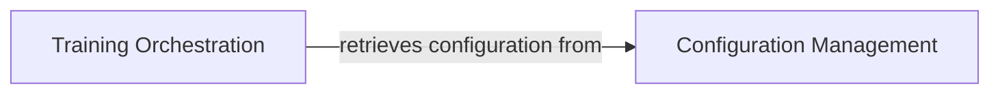

## Details

One paragraph explaining the functionality which is represented by this graph. What the main flow is and what is its purpose.

### Configuration Management [[Expand]](./Configuration_Management.md)
This component, primarily embodied by the `SmolLM3Config` dataclass and the `get_config` function in `config/train_smollm3.py`, is responsible for the centralized definition, loading, validation, and provision of access to all training parameters, model specifications, data paths, and hyperparameters. It supports loading both base and custom configurations, ensuring that all necessary settings are available and correctly formatted for the training and fine-tuning processes.

**Related Classes/Methods**: _None_

### Training Orchestration
This component represents the main scripts or modules responsible for initiating and coordinating the training and fine-tuning processes. It acts as the primary entry point for different training runs, retrieving necessary configurations and orchestrating the overall training pipeline.

**Related Classes/Methods**: _None_

### [FAQ](https://github.com/CodeBoarding/GeneratedOnBoardings/tree/main?tab=readme-ov-file#faq)