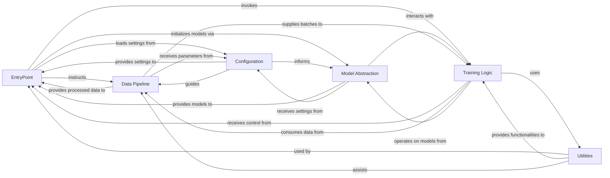

## Details

Final component overview for the `smollm3_finetune` project, based on the provided analysis and adhering to Machine Learning Training and Fine-tuning Framework patterns.

### EntryPoint
The main entry point of the application, responsible for orchestrating the entire training and fine-tuning workflow. It initializes other core components, loads configurations, and manages the overall execution flow.

**Related Classes/Methods**:

- `smollm3_finetune.train` (1:1)

### Configuration
Centralizes and defines all parameters and settings required for the training and fine-tuning process, including model hyperparameters, dataset paths, and training arguments. It promotes a configuration-driven architecture, allowing easy modification and versioning of experimental setups.

**Related Classes/Methods**:

- <a href="https://github.com/Josephrp/SmolFactory/docs/blob/main/src/config.py#L1-L1" target="_blank" rel="noopener noreferrer">`config` (1:1)</a>

### Model Abstraction [[Expand]](./Model_Abstraction.md)
Encapsulates the logic for loading, initializing, and managing different machine learning models and their variants (e.g., different architectures, quantization settings). It provides a consistent interface for interacting with various model architectures.

**Related Classes/Methods**:

- <a href="https://github.com/Josephrp/SmolFactory/docs/main/src/model.py#L1-L1" target="_blank" rel="noopener noreferrer">`model` (1:1)</a>

### Data Pipeline [[Expand]](./Data_Pipeline.md)
Handles the entire data lifecycle, including dataset loading, preprocessing (e.g., tokenization, formatting), and creating efficient data loaders for both training and evaluation phases. It ensures data is prepared correctly and efficiently for the model.

**Related Classes/Methods**:

- `smollm3_finetune.data.load_and_preprocess_data` (1:1)

### Training Logic
Contains the core algorithms and routines for training and fine-tuning machine learning models. This includes the training loop, optimization steps, loss calculation, gradient accumulation, and potentially specialized fine-tuning methods (e.g., LoRA, QLoRA).

**Related Classes/Methods**:

- <a href="https://github.com/Josephrp/SmolFactory/docs/blob/main/src/trainer.py#L1-L1" target="_blank" rel="noopener noreferrer">`trainer` (1:1)</a>

### Utilities
A collection of common helper functions, reusable modules, and general-purpose tools that support various parts of the training framework but do not belong to a specific core component. This includes functions for logging, metrics calculation, device management, etc.

**Related Classes/Methods**:

- `utils` (1:1)

### [FAQ](https://github.com/CodeBoarding/GeneratedOnBoardings/tree/main?tab=readme-ov-file#faq)