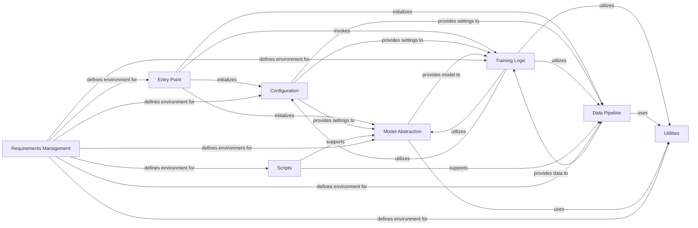

## Details

Component overview for the Machine Learning Training and Fine-tuning Framework.

### Entry Point [[Expand]](./Entry_Point.md)
The primary execution script that orchestrates the entire training process. It initializes all other major components, loads configurations, sets up the training environment, and invokes the core training logic.

**Related Classes/Methods**:

- `train.py`

### Configuration
Centralized management of all training parameters, model hyperparameters, dataset paths, and other environment settings. It defines the schema for configurations, often using dataclasses, and supports both base and custom configurations.

**Related Classes/Methods**:

- `config/` (1:1)

### Model Abstraction [[Expand]](./Model_Abstraction.md)
Responsible for abstracting the underlying machine learning model. This includes loading pre-trained models, handling different model architectures or variants, and preparing the model for training (e.g., quantization, device placement).

**Related Classes/Methods**:

- <a href="https://github.com/Josephrp/SmolFactory/docs/blob/main/src/model.py#L1-L1" target="_blank" rel="noopener noreferrer">`model.py` (1:1)</a>

### Data Pipeline [[Expand]](./Data_Pipeline.md)
Manages the entire data flow, from loading raw datasets to preprocessing, tokenization, and creating efficient data loaders (e.g., PyTorch `DataLoader`) for batching and shuffling data during training and evaluation.

**Related Classes/Methods**:

- <a href="https://github.com/Josephrp/SmolFactory/docs/blob/main/src/data.py#L1-L1" target="_blank" rel="noopener noreferrer">`data.py` (1:1)</a>

### Training Logic
Encapsulates the core training loop, including forward and backward passes, loss calculation, optimization steps, and integration of callbacks for monitoring and control. It may include specialized trainers for different fine-tuning methods.

**Related Classes/Methods**:

- <a href="https://github.com/Josephrp/SmolFactory/docs/blob/main/src/trainer.py#L1-L1" target="_blank" rel="noopener noreferrer">`trainer.py` (1:1)</a>

### Utilities
Provides a collection of common helper functions, classes, and modules used across various components. This includes functionalities like logging, metric calculation, checkpointing, and general data manipulation.

**Related Classes/Methods**:

- `utils/` (1:1)

### Scripts
Contains auxiliary scripts that support the overall project but are separate from the main training pipeline. Examples include data preparation scripts, model conversion tools, or deployment-related utilities.

**Related Classes/Methods**:

- `scripts/` (1:1)

### Requirements Management
Defines and manages all project dependencies, ensuring a consistent and reproducible development and deployment environment. This typically involves `requirements.txt` files or similar dependency management tools.

**Related Classes/Methods**:

- `requirements/` (1:1)

### [FAQ](https://github.com/CodeBoarding/GeneratedOnBoardings/tree/main?tab=readme-ov-file#faq)