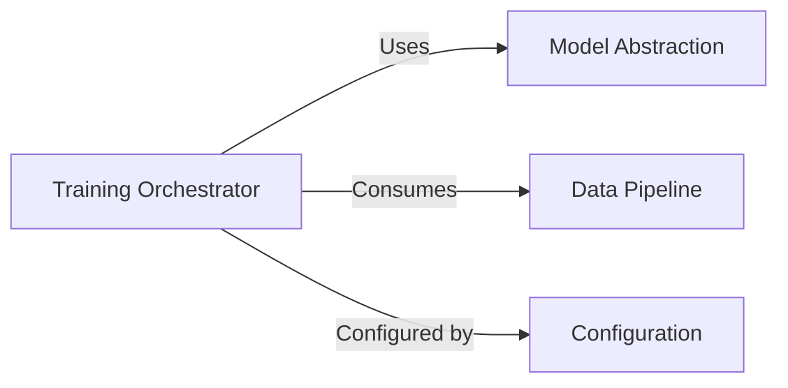

## Details

One paragraph explaining the functionality which is represented by this graph. What the main flow is and what is its purpose.

### Training Orchestrator [[Expand]](./Training_Orchestrator.md)
Implements the core training and fine-tuning loop. This includes managing forward and backward passes, optimization, loss calculation, and integration with acceleration libraries (e.g., accelerate). It also handles callbacks and evaluation logic.

**Related Classes/Methods**:

- <a href="https://github.com/Josephrp/SmolFactory/docs/blob/main/src/trainer.py#L1-L9999" target="_blank" rel="noopener noreferrer">`src.trainer` (1:9999)</a>

### Model Abstraction [[Expand]](./Model_Abstraction.md)
Provides an abstract interface for loading, configuring, and managing different language models. It handles model initialization, tokenizer loading, and potentially quantization settings, ensuring compatibility with various model architectures and training setups.

**Related Classes/Methods**:

- <a href="https://github.com/Josephrp/SmolFactory/docs/blob/main/src/model.py#L1-L9999" target="_blank" rel="noopener noreferrer">`src.model` (1:9999)</a>

### Data Pipeline [[Expand]](./Data_Pipeline.md)
Manages the entire data processing workflow, from loading raw datasets to tokenization, formatting, and preparing data for training. It ensures efficient data handling, including features like dataset sharding, shuffling, and batching.

**Related Classes/Methods**:

- <a href="https://github.com/Josephrp/SmolFactory/docs/blob/main/src/data.py#L1-L9999" target="_blank" rel="noopener noreferrer">`src.data` (1:9999)</a>

### Configuration
Centralizes all configurable parameters for the training process, including model parameters, training arguments, dataset paths, and optimization settings. It provides a structured way to define and access these settings, enabling easy modification and experimentation.

**Related Classes/Methods**:

- <a href="https://github.com/Josephrp/SmolFactory/docs/blob/main/src/config.py#L1-L9999" target="_blank" rel="noopener noreferrer">`src.config` (1:9999)</a>

### [FAQ](https://github.com/CodeBoarding/GeneratedOnBoardings/tree/main?tab=readme-ov-file#faq)