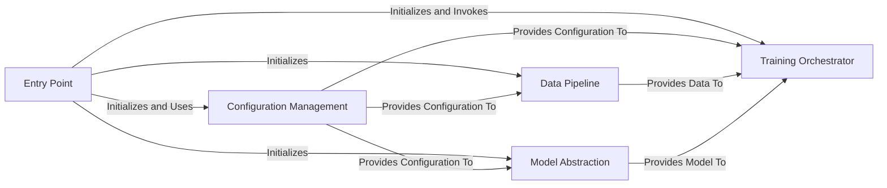

## Details

Abstract Components Overview

### Entry Point [[Expand]](./Entry_Point.md)
The primary execution script that orchestrates the entire training process. It initializes all other major components, loads configurations, sets up the training environment, and invokes the `Training Orchestrator`.

**Related Classes/Methods**:

- `train`

### Configuration Management [[Expand]](./Configuration_Management.md)
Centralized management of all training parameters, model specifications, data paths, and hyper-parameters. It is responsible for loading, validating, and providing access to configuration settings, supporting base and custom configurations.

**Related Classes/Methods**:

- <a href="https://github.com/Josephrp/SmolFactory/docs/blob/main/src/config.py#L1-L1" target="_blank" rel="noopener noreferrer">`config` (1:1)</a>

### Data Pipeline [[Expand]](./Data_Pipeline.md)
Handles the entire data lifecycle, including dataset loading, preprocessing (e.g., tokenization, formatting), and creating efficient data loaders for both training and evaluation phases.

**Related Classes/Methods**:

- <a href="https://github.com/Josephrp/SmolFactory/docs/blob/main/src/data.py#L1-L1" target="_blank" rel="noopener noreferrer">`data` (1:1)</a>

### Model Abstraction [[Expand]](./Model_Abstraction.md)
Encapsulates the logic for loading pre-trained models, defining model architectures, and managing different model variants (e.g., quantization, LoRA adapters). It provides a consistent interface for model interaction.

**Related Classes/Methods**:

- <a href="https://github.com/Josephrp/SmolFactory/docs/blob/main/src/model.py#L1-L1" target="_blank" rel="noopener noreferrer">`model` (1:1)</a>

### Training Orchestrator [[Expand]](./Training_Orchestrator.md)
Implements the core training and fine-tuning loop. This includes managing forward and backward passes, optimization, loss calculation, and integration with acceleration libraries (e.g., `accelerate`). It also handles callbacks and evaluation logic.

**Related Classes/Methods**:

- <a href="https://github.com/Josephrp/SmolFactory/docs/blob/main/src/trainer.py#L1-L1" target="_blank" rel="noopener noreferrer">`trainer` (1:1)</a>

